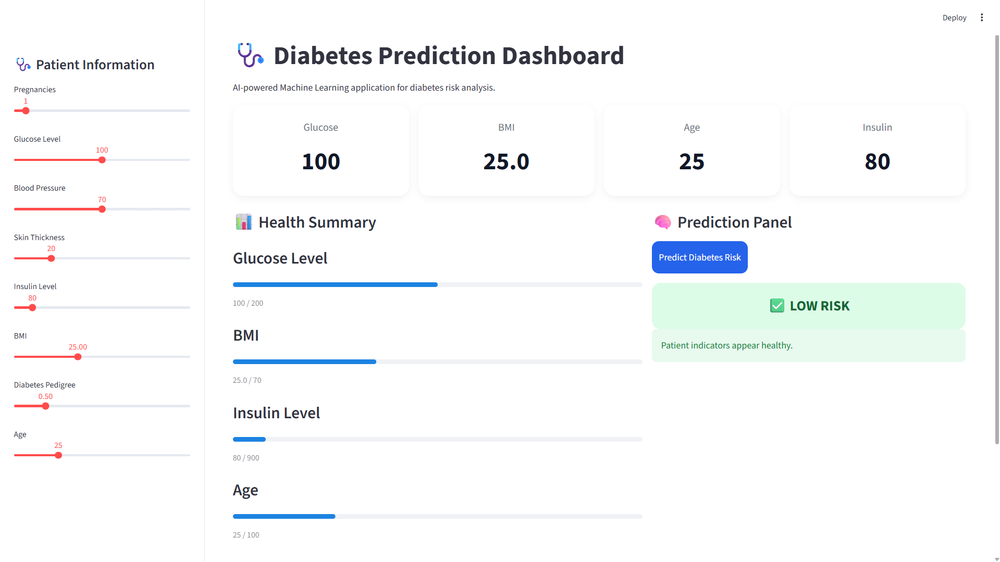

# 🩺 Diabetes Prediction Dashboard

An AI-powered Machine Learning web application that predicts diabetes risk based on patient health parameters using a trained ML model.

---

## 🚀 Live Demo

🔗 Streamlit App:  
https://diabetes-prediction-app-ayush.streamlit.app/

---

## 📌 Features

- AI-powered diabetes risk prediction
- Interactive and professional dashboard UI
- Real-time patient health analytics
- Machine Learning model integration
- Responsive Streamlit deployment
- User-friendly sidebar controls

---

## 🛠️ Tech Stack

- Python
- Streamlit
- Scikit-learn
- Pandas
- NumPy
- Pickle

---

## 📊 Machine Learning Workflow

1. Data Collection
2. Data Cleaning & Preprocessing
3. Feature Scaling using StandardScaler
4. Model Training
5. Diabetes Risk Prediction
6. Streamlit Deployment

---

## 📂 Project Structure

```bash
├── app.py
├── model.py
├── diabetes.csv
├── saved_model.sav
├── scaler.sav
├── dashboard.png
├── requirements.txt
└── README.md

```

---

## 📷 Dashboard Preview



---

## ▶️ Run Locally

### Clone the repository

```bash
git clone https://github.com/ayushmauryaiitj/Diabetes-Prediction-app.git
```

### Navigate to project directory

```bash
cd Diabetes-Prediction-app
```

### Install dependencies

```bash
pip install -r requirements.txt
```

### Run the application

```bash
streamlit run app.py
```

---

## 🎯 Future Improvements

- Advanced health analytics
- Explainable AI integration
- User authentication
- Database connectivity
- API deployment support

---

## 👨‍💻 Author

**Ayush Maurya**  
BS in Applied AI & Data Science @ IIT Jodhpur

🔗 GitHub:  
https://github.com/ayushmauryaiitj

🔗 LinkedIn:  
https://www.linkedin.com/in/ayushmauryaii/